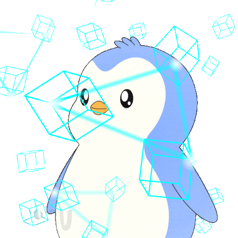

    

<h1 align="center"><b>Hi , I'm Sunshine1917 </b></h1>

&nbsp;***About me***

I am a Computer Engineering student at the Benemérita Universidad Autónoma de Puebla. I am proficient in the programming languages ​C,​ C++, Python and Shell are the programming languages I am good at. I am passionate about learning about new technologies and creating new, productive, innovative, and creative projects.
* **I am interested in machine learning, embedded systems, web and mobile development.**
- 🔭 I’m currently learning ...
  - JavaScript 
  - FastAPI
  - Docker
  - C#
- I’m looking forward to collaborate on open source projects. 🦉
- Ask me anything you want, I'll be happy to help.☝🏽🤓  

- Outside tech, 📖 I love reading fantasy, 🏀 play basketball, 🎵 listen to music,☕️ drinking coffee and 🏔️ explore nature outdoors.
- 📫 Reach out to me at: <a href="alejandro.juarez.120104@gmail.com">alejandro.juarez.120104@gmail.com</a>

## <b> My Skills Include</b>

***Languages***
    

***Frameworks***&emsp;&emsp;&emsp;&emsp;&emsp;&emsp;&emsp;&emsp;&emsp;&emsp;***Databases***

 
&emsp;&emsp;&emsp; 

***IDE***

<h3 align="center" > Connect with me 
</h3>

 

	 
	 
 

